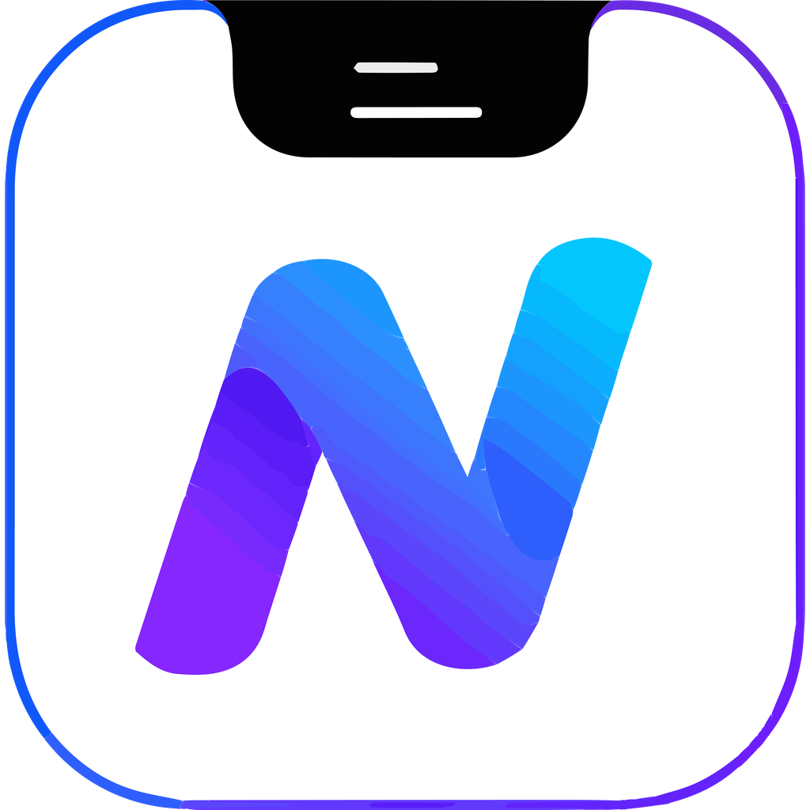
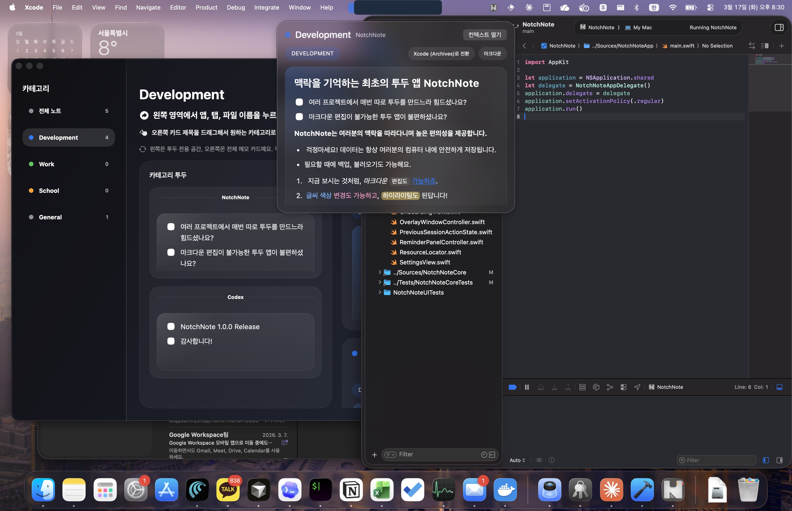
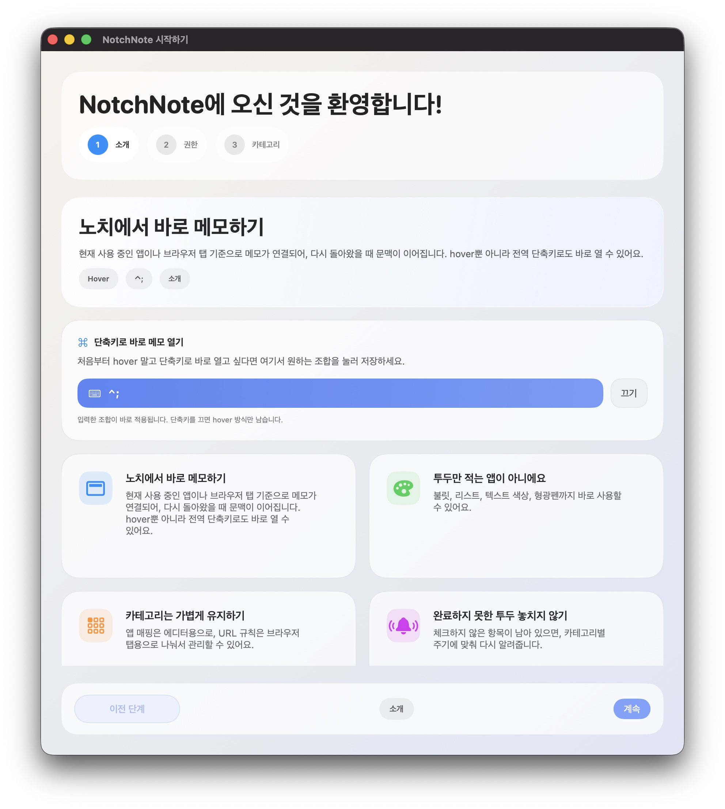
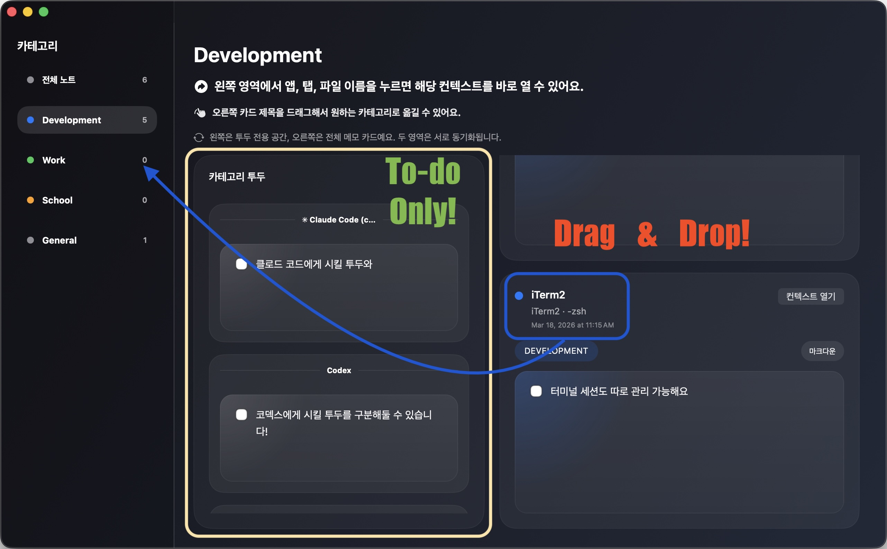
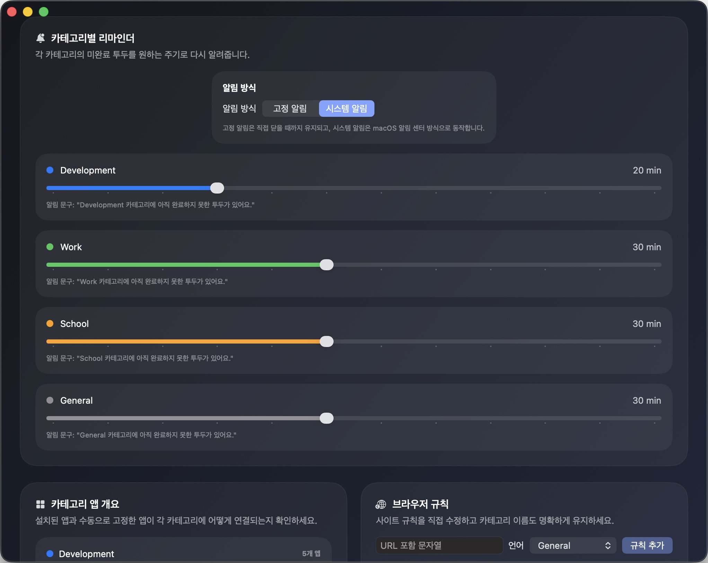
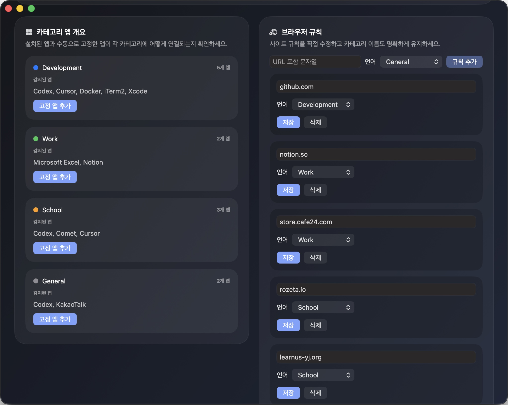
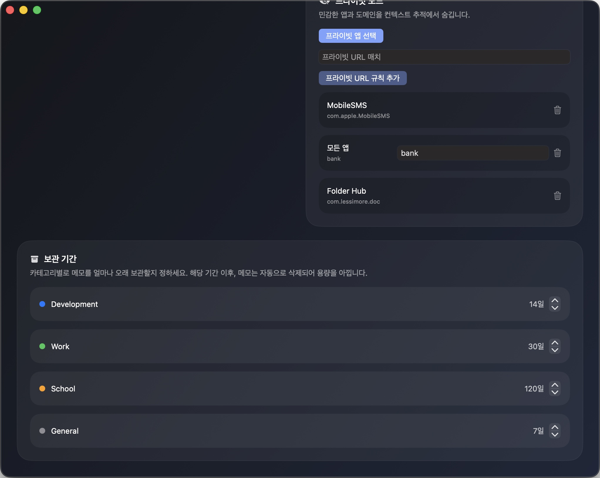
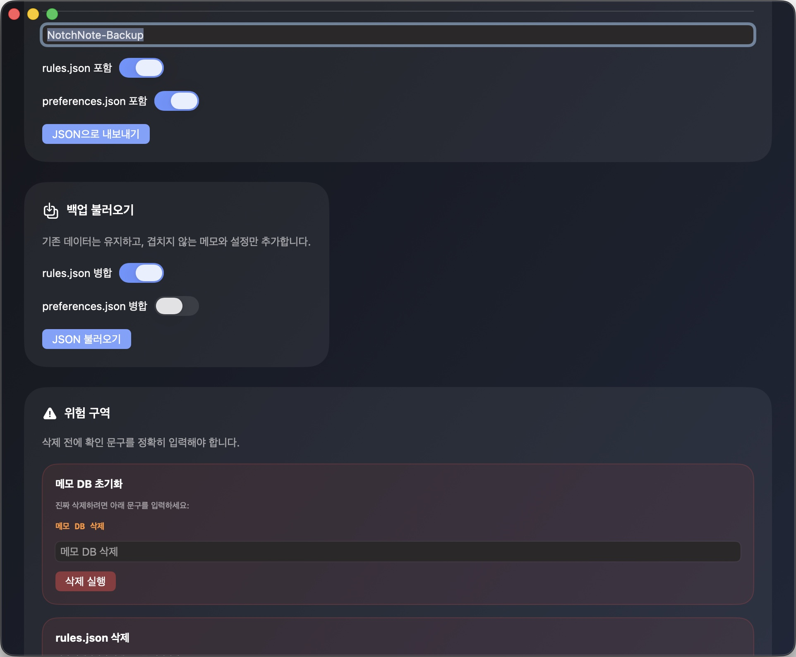

# NotchNote

[한국어](#korean) | [English](#english)

## 한국어

- 여러 프로젝트에서 매번 투두를 따로 만드느라 피곤하셨나요?

- 마크다운 편집이 불가능한 투두 앱이 불편했던 적 있으신가요?

NotchNote는 현재 보고 있는 앱, 브라우저, 프로젝트, 터미널 세션의 맥락을 안전하게 따라다니며 메모를 연결해주는 macOS 메모 앱입니다.

호버로 빠르게 열 수도 있고, 전역 단축키로 바로 열 수도 있습니다. 메모는 단순한 텍스트 저장이 아니라, 카테고리별 정리, 투두 관리, 리마인더, 백업/복원까지 하나의 흐름으로 이어집니다. 메모 데이터는 사용자 컴퓨터 내부에 암호화되어 유출될 일이 없습니다!

### 다운로드

- GitHub Release에서 `NotchNote.zip`을 다운로드하세요.
[다운로드 링크](https://github.com/Dindb-dong/NotchNote-Releases/releases)
- `Source code (zip)` / `Source code (tar.gz)`는 설치 파일이 아닙니다.
- 압축 해제 후 `NotchNote.app`을 실행하면 됩니다.

### 이런 분께 잘 맞습니다

- 여러 프로젝트를 오가며 컨텍스트별 메모를 따로 남기고 싶은 분
- 브라우저 탭, IDE 프로젝트, 터미널 세션까지 이어서 기록하고 싶은 분
- 마크다운 편집과 체크리스트를 한 앱 안에서 같이 쓰고 싶은 분
- 카테고리별 리마인더, 보관 기간, 백업/복원까지 직접 관리하고 싶은 분

### 대표 화면

현재 작업 중인 앱 위에서 바로 메모를 여는 흐름입니다.

### 주요 기능

#### 1. 바로 열리는 컨텍스트 메모

hover 또는 전역 단축키로 overlay를 열면, 지금 보고 있는 맥락에 맞는 메모가 이어집니다.

#### 2. Library에서 한 번에 정리

왼쪽은 카테고리 투두, 오른쪽은 전체 메모 카드입니다. 두 영역은 서로 연결되어 있고, 컨텍스트별로 빠르게 다시 열 수 있습니다.

#### 3. 카테고리별 리마인더

카테고리마다 미완료 투두를 다시 알려주는 주기를 다르게 설정할 수 있습니다.

#### 4. 카테고리 규칙과 프라이버시 설정

앱/브라우저 규칙, 프라이빗 앱/URL, 보관 기간 같은 정책을 직접 관리할 수 있습니다.

#### 5. 백업과 복원

메모 DB와 설정을 JSON으로 내보내고, additive import 방식으로 안전하게 다시 가져올 수 있습니다.

### 첫 실행 안내

처음 실행할 때 macOS가 로그인 비밀번호를 요청할 수 있습니다. 이것은 NotchNote가 로컬 데이터베이스 키를 macOS Keychain에 안전하게 저장하거나 읽기 위한 정상 동작입니다.

- 이 비밀번호는 NotchNote가 직접 수집하지 않습니다.
- macOS Keychain 시스템 UI에서만 처리됩니다.
- 이 과정을 거쳐야 로컬 메모 데이터베이스를 정상적으로 열 수 있습니다.

### 배포 안내

- NotchNote는 macOS용 독점 소프트웨어로 배포됩니다.
- 소스코드는 공개되지 않습니다.
- 자세한 조건은 아래 문서를 확인해주세요.

### 문서

- [LICENSE.md](LICENSE.md)
- [EULA.md](EULA.md)

---

## English

NotchNote is a macOS note app that keeps your notes safely attached to the context you are actually working in, including apps, browser tabs, projects, and terminal sessions.

You can open it by hover or by a global shortcut. It goes beyond simple note capture by connecting markdown editing, checklists, categories, reminders, and backup/restore into one workflow. The memo datas will be encrypted in your PC, so there are no probabilities that datas are leaked.

### Download

- Download `NotchNote.zip` from the GitHub Release page.
[Download](https://github.com/Dindb-dong/NotchNote-Releases/releases) 
- `Source code (zip)` and `Source code (tar.gz)` are not installable app builds.
- Unzip the file and launch `NotchNote.app`.

### Great For

- people juggling multiple projects and wanting separate notes per context
- people who want browser, IDE, and terminal-aware memo continuity
- people who want markdown editing and checklists in the same app
- people who want category-level reminders, retention rules, and backups under their own control

### Hero Screen

Open the memo overlay directly on top of the app you are currently using.

### Key Features

#### 1. Context-aware quick capture

Open the overlay by hover or global shortcut and continue writing in the memo for the current context.

#### 2. Organize everything in Library

The left side is a category todo workspace, and the right side is a full memo-card view. Both stay connected to the same underlying notes.

#### 3. Per-category reminders

Set different reminder intervals for unfinished todos in each category.

#### 4. Rules, privacy, and retention controls

Manage app/browser rules, private app or URL filters, and category retention policies yourself.

#### 5. Backup and restore

Export your memo database and settings to JSON, then restore them safely with additive import.

### First Launch Note

On first launch, macOS may ask for your login password. This is expected and is used so NotchNote can safely store or retrieve its local database key from macOS Keychain.

- NotchNote does not directly collect your password.
- The prompt is handled by macOS Keychain UI.
- Approving it allows the app to open its local memo database correctly.

### Distribution

- NotchNote is distributed as proprietary macOS software.
- The source code is not public.
- For full terms, please see the documents below.

### Documents

- [LICENSE.md](LICENSE.md)
- [EULA.md](EULA.md)
