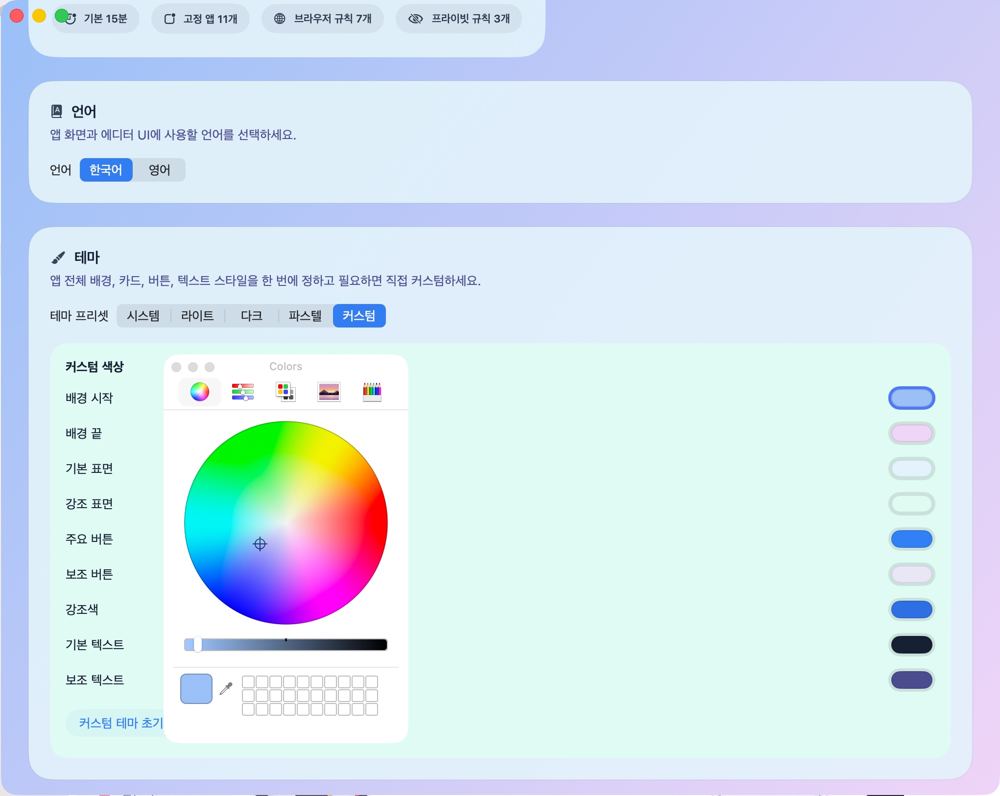
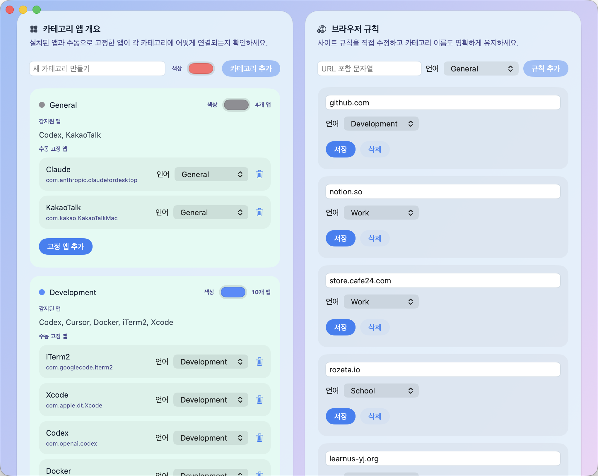
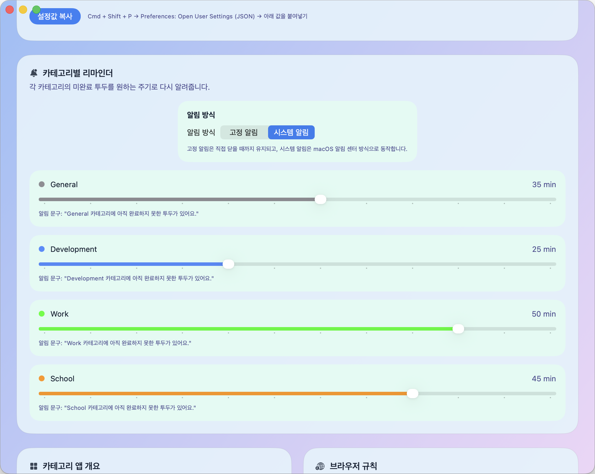

# NotchNote

[한국어](#korean) | [English](#english)

## 한국어

- 여러 프로젝트에서 매번 투두를 따로 만드느라 피곤하셨나요?

- 마크다운 편집이 불가능한 투두 앱이 불편했던 적 있으신가요?

NotchNote는 현재 보고 있는 앱, 브라우저, 프로젝트, 터미널 세션의 맥락을 안전하게 따라다니며 메모를 연결해주는 macOS 메모 앱입니다.

hover로 빠르게 열 수도 있고, 전역 단축키로 바로 열 수도 있습니다. 메모는 단순 저장이 아니라 마크다운 편집, 체크리스트, 카테고리 분류, 리마인더, 백업/복원까지 하나의 흐름으로 이어집니다.

### 1.1.0에서 달라진 점

- pinned 메모창 추가
  - 메모창을 항상 떠 있게 고정 가능
  - 단축키로 숨겼다가 같은 위치에 다시 복원 가능
- 앱 전체 테마 시스템 추가
  - `System`, `Light`, `Dark`, `Pastel`, `Custom`
  - 배경, 버튼, 텍스트 색까지 커스텀 가능
- 카테고리 관리 강화
  - 온보딩과 설정에서 모두 카테고리 생성 가능
  - 카테고리 색상 직접 변경 가능
- IDE 프로젝트 추적 강화
  - 같은 앱 안에서 여러 프로젝트를 오가도 메모 분리가 더 안정적
- Library / overlay 편집기 스크롤과 렌더링 안정화

### 다운로드

- GitHub Release에서 `NotchNote.dmg`를 다운로드하는 것을 권장합니다.
[다운로드 링크](https://github.com/Dindb-dong/NotchNote-Releases/releases)
- `NotchNote.dmg`를 열고 `NotchNote.app`를 `Applications` 폴더로 드래그하세요.
- `NotchNote.zip`도 함께 제공할 수 있지만, 일반 사용자에게는 `.dmg`가 더 익숙한 설치 방식입니다.
- `Source code (zip)` / `Source code (tar.gz)`는 설치 파일이 아닙니다.

### 업데이트 설치

- 이미 기존 버전을 사용 중이라면, 새로 받은 `NotchNote.app`로 기존 앱을 교체하면 됩니다.
- `.dmg`를 다시 열어 `Applications` 폴더의 기존 `NotchNote.app`를 새 버전으로 덮어쓰는 방식으로 업데이트하면 됩니다.
- 메모와 설정 데이터는 앱 번들 내부가 아니라 macOS의 Application Support / Keychain 쪽에 저장되므로, 앱만 교체해도 기존 데이터는 유지됩니다.
- 다운로드 폴더에서 바로 실행하면 예전 앱과 새 앱이 동시에 남을 수 있으니, 가능하면 `Applications` 폴더의 앱을 교체해서 사용하는 것을 권장합니다.

### 이런 분께 잘 맞습니다

- 여러 프로젝트를 오가며 컨텍스트별 메모를 따로 남기고 싶은 분
- 브라우저 탭, IDE 프로젝트, 터미널 세션까지 이어서 기록하고 싶은 분
- 마크다운 편집과 체크리스트를 한 앱 안에서 같이 쓰고 싶은 분
- 카테고리별 리마인더, 보관 기간, 백업/복원까지 직접 관리하고 싶은 분

### 대표 화면

현재 작업 중인 앱 위에서 바로 메모를 여는 흐름입니다.

### 주요 기능

#### 1. 바로 열리는 컨텍스트 메모

hover 또는 전역 단축키로 overlay를 열면, 지금 보고 있는 맥락에 맞는 메모가 이어집니다.

#### 2. 고정 메모창과 테마 커스터마이징

pinned 메모창으로 항상 띄워둘 수 있고, 테마 프리셋이나 커스텀 색상으로 앱 분위기를 바꿀 수 있습니다.

#### 3. Library에서 한 번에 정리

왼쪽은 카테고리 투두, 오른쪽은 전체 메모 카드입니다. 두 영역은 서로 연결되어 있고, 컨텍스트별로 빠르게 다시 열 수 있습니다.

#### 4. 카테고리 규칙과 색상 관리

설정에서 카테고리를 만들고, 색을 바꾸고, 앱/브라우저 규칙을 연결할 수 있습니다.

#### 5. 카테고리별 리마인더

카테고리마다 미완료 투두를 다시 알려주는 주기를 다르게 설정할 수 있습니다.

#### 6. 백업과 복원

메모 DB와 설정을 JSON으로 내보내고, additive import 방식으로 안전하게 다시 가져올 수 있습니다.

### 첫 실행 안내

처음 실행할 때 macOS가 로그인 비밀번호를 요청할 수 있습니다. 이것은 NotchNote가 로컬 데이터베이스 키를 macOS Keychain에 안전하게 저장하거나 읽기 위한 정상 동작입니다.

- 이 비밀번호는 NotchNote가 직접 수집하지 않습니다.
- macOS Keychain 시스템 UI에서만 처리됩니다.
- 이 과정을 거쳐야 로컬 메모 데이터베이스를 정상적으로 열 수 있습니다.

### 배포 안내

- NotchNote는 macOS용 독점 소프트웨어로 배포됩니다.
- 소스코드는 공개되지 않습니다.
- 자세한 조건은 아래 문서를 확인해주세요.

### 문서

- [LICENSE.md](LICENSE.md)
- [EULA.md](EULA.md)

---

## English

NotchNote is a macOS note app that keeps your notes attached to the context you are actually working in, including apps, browser tabs, projects, and terminal sessions.

You can open it by hover or by a global shortcut. It goes beyond simple note capture by connecting markdown editing, checklists, categories, reminders, and backup/restore into one workflow.

### What’s New in 1.1.0

- Added pinned memo overlay mode
  - keep the memo window visible
  - hide and restore it with the global hotkey in the same position
- Added an app-wide theme system
  - `System`, `Light`, `Dark`, `Pastel`, `Custom`
  - customize background, button, and text colors
- Expanded category management
  - create categories from onboarding and Settings
  - edit category colors directly
- Improved same-app multi-project tracking for IDE workflows
- Stabilized editor scrolling and rendering across overlay and Library

### Download

- Download `NotchNote.dmg` from the GitHub Release page.
[Download](https://github.com/Dindb-dong/NotchNote-Releases/releases)
- Open the `.dmg` and drag `NotchNote.app` into the `Applications` folder.
- `NotchNote.zip` can still be offered as a fallback, but `.dmg` is the more familiar install flow for most macOS users.
- `Source code (zip)` and `Source code (tar.gz)` are not installable app builds.

### Updating

- If you already have an older version installed, replace the existing `NotchNote.app` with the newly downloaded one.
- In most cases, updating simply means opening the new `.dmg` and overwriting the old app inside the `Applications` folder.
- Memo data and preferences are stored outside the app bundle in Application Support / Keychain, so replacing the app should keep existing data intact.
- If you run the new app directly from the Downloads folder, the old app and the new app may both remain on disk, so replacing the app in `Applications` is recommended.

### Great For

- people juggling multiple projects and wanting separate notes per context
- people who want browser, IDE, and terminal-aware memo continuity
- people who want markdown editing and checklists in the same app
- people who want category-level reminders, retention rules, and backups under their own control

### Hero Screen

Open the memo overlay directly on top of the app you are currently using.

### Key Features

#### 1. Context-aware quick capture

Open the overlay by hover or global shortcut and continue writing in the memo for the current context.

#### 2. Pinned overlay and themes

Keep the memo visible with pinned mode and restyle the app with built-in presets or custom colors.

#### 3. Organize everything in Library

The left side is a category todo workspace, and the right side is a full memo-card view. Both stay connected to the same underlying notes.

#### 4. Category rules and colors

Create categories, change their colors, and connect app/browser rules from Settings.

#### 5. Per-category reminders

Set different reminder intervals for unfinished todos in each category.

#### 6. Backup and restore

Export your memo database and settings to JSON, then restore them safely with additive import.

### First Launch Note

On first launch, macOS may ask for your login password. This is expected and is used so NotchNote can safely store or retrieve its local database key from macOS Keychain.

- NotchNote does not directly collect your password.
- The prompt is handled by macOS Keychain UI.
- Approving it allows the app to open its local memo database correctly.

### Distribution

- NotchNote is distributed as proprietary macOS software.
- The source code is not public.
- For full terms, please see the documents below.

### Documents

- [LICENSE.md](LICENSE.md)
- [EULA.md](EULA.md)
