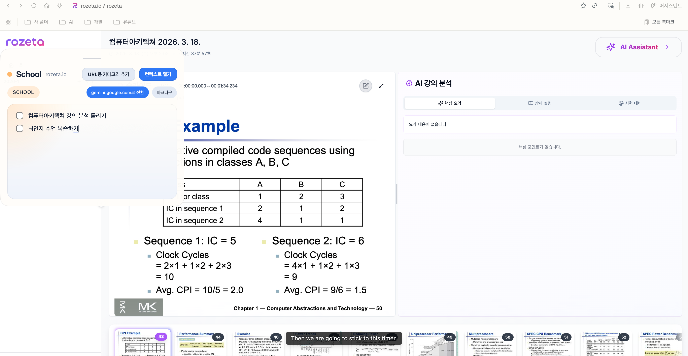
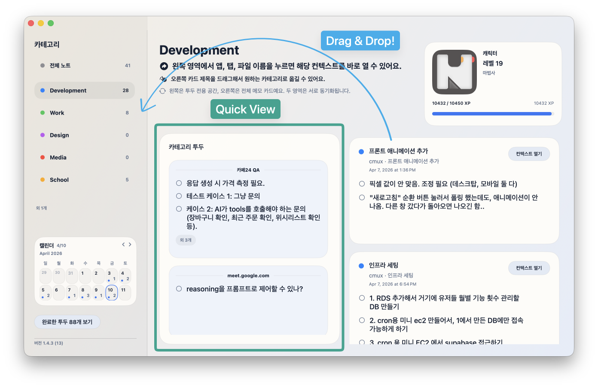
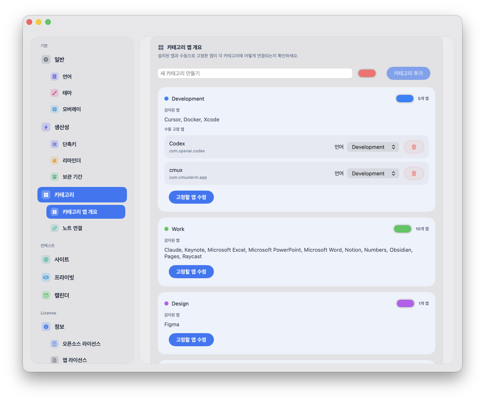
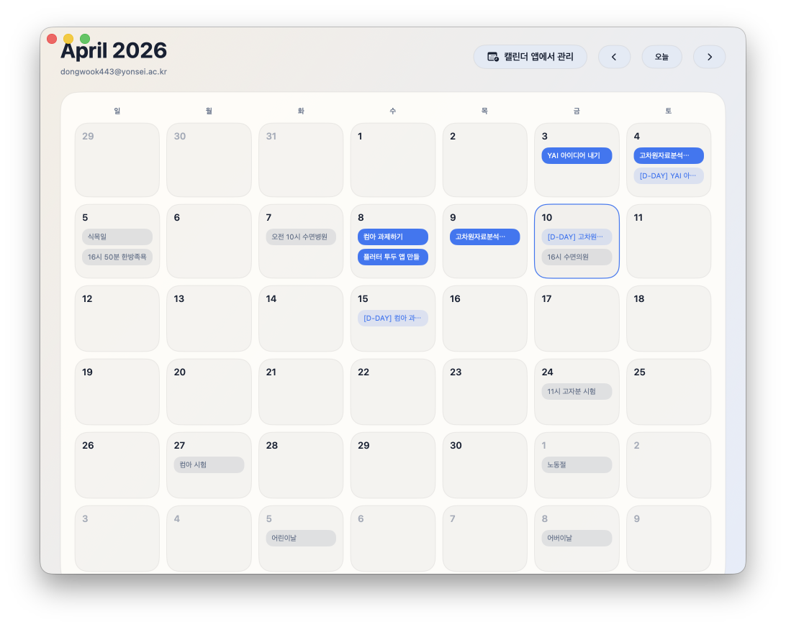
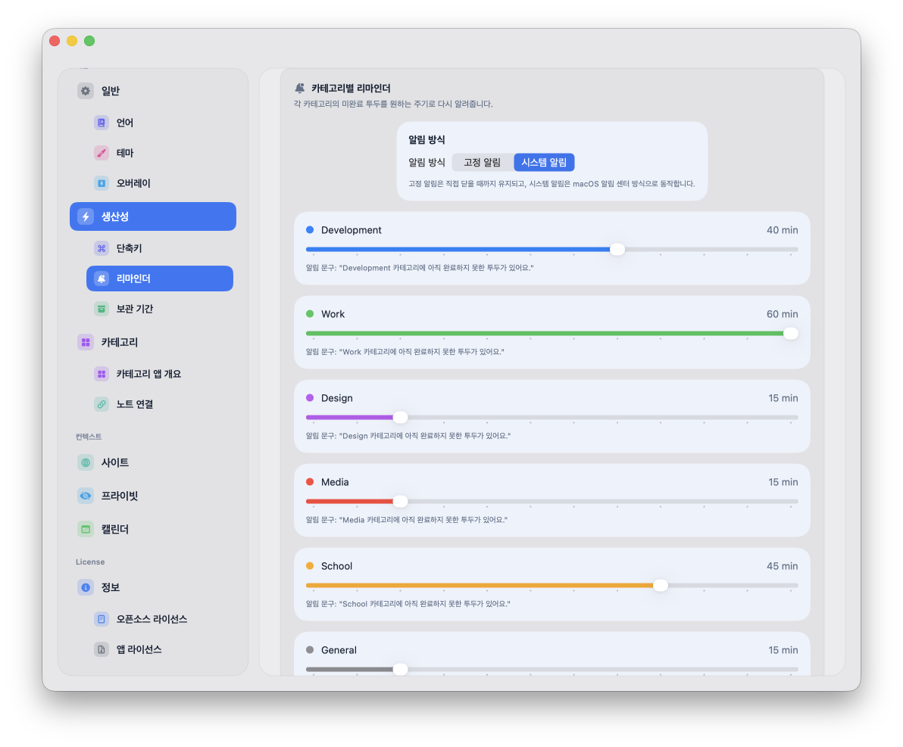
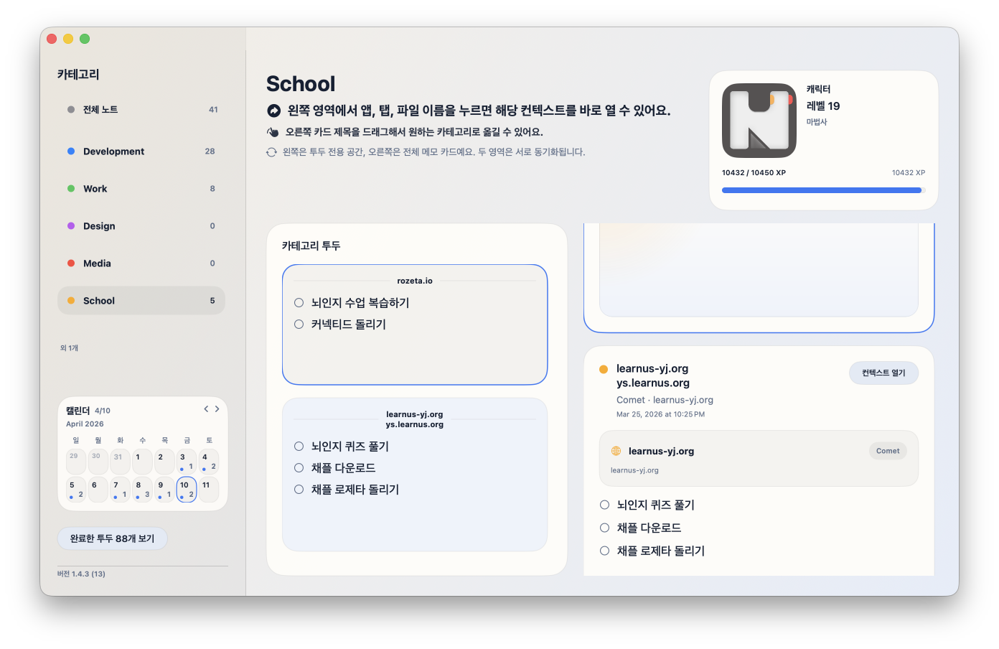
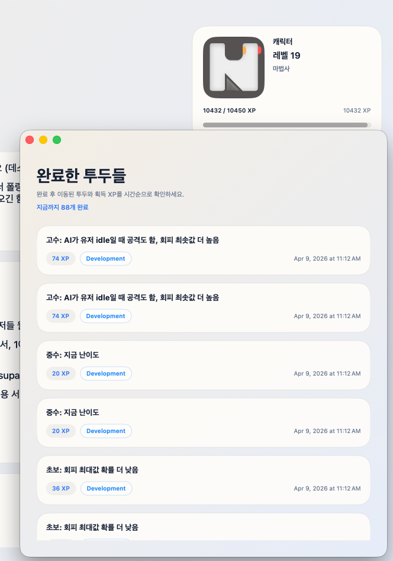

# NotchNote
## Recommended macOS version: 26+
[한국어](#korean) | [English](#english)

## 한국어

NotchNote는 **지금 작업 중인 맥락(앱/브라우저/프로젝트/세션)** 에 메모를 붙여두는 macOS 메모 앱입니다.
메모를 빨리 열고, 같은 맥락에서 다시 이어 쓰는 경험에 집중했습니다.

### 핵심 기능

- **컨텍스트 메모**: 현재 보고 있는 앱/브라우저/프로젝트 기준으로 메모를 자동 연결합니다.
- **빠른 열기 + 고정 메모창**: hover 또는 전역 단축키로 즉시 열고, pinned 모드로 항상 띄워둘 수 있습니다.
- **Library 워크스페이스**: 카테고리, 투두, 메모 카드를 한 화면에서 정리할 수 있습니다.
- **캘린더 워크스페이스**: 날짜 기반 할 일을 관리하고 Google 캘린더 연동 흐름을 지원합니다.
- **리마인더 / 보관 기간 / 백업·복원**: 카테고리별 리마인더, 보관 기간, JSON 내보내기/가져오기를 제공합니다.
- **테마 커스터마이징**: `System`, `Light`, `Dark`, `Pastel`, `Custom` 테마를 지원합니다.

### 부가 기능

- **노트 연결(Linked Notes)**: 관련 있는 컨텍스트를 연결해 하나의 메모를 공유할 수 있습니다.
- **컨텍스트 바로가기(Open Context)**: 가능한 경우 원래 작업 중이던 파일/프로젝트 창으로 빠르게 복귀할 수 있습니다.
- **완료 히스토리 + XP/레벨업**: 완료한 투두는 전역 히스토리로 이동하고, 누적 XP 기반으로 레벨이 올라갑니다.

### 다운로드

- [GitHub Releases에서 `NotchNote.dmg` 다운로드](https://github.com/Dindb-dong/NotchNote-Releases/releases)
- `.dmg`를 열고 `NotchNote.app`를 `Applications` 폴더로 드래그
- `Source code (zip/tar.gz)`는 설치 파일이 아닙니다

### 업데이트

- 기존 앱이 있다면 `Applications`의 `NotchNote.app`를 새 버전으로 교체하면 됩니다.
- 메모/설정 데이터는 앱 번들 외부(Application Support/Keychain)에 저장되어 유지됩니다.

### 스크린샷

#### 1) Overlay 빠른 메모

현재 작업 중인 앱 위에서 즉시 메모를 열고, 컨텍스트에 맞는 본문으로 바로 이어서 작성하는 화면입니다.

#### 2) Pinned 메모창

메모창을 고정해 두고 작업하면서도 문맥은 계속 따라가도록 쓰는 화면입니다.

#### 3) Library 전체 화면

카테고리/투두 목록과 메모 카드를 함께 보면서 정리하는 메인 워크스페이스입니다.

#### 4) Settings 섹션형 사이드바

일반, 생산성, 카테고리, 사이트, 프라이빗, 캘린더, 정보 설정을 섹션별로 관리하는 화면입니다.

#### 5) Calendar 워크스페이스

날짜별 할 일과 일정 흐름을 월간 뷰 중심으로 관리하는 화면입니다.

#### 6) Category & Reminder 설정

카테고리 규칙, 색상, 리마인더 주기 등 운영 설정을 조정하는 화면입니다.

#### 7) Linked Notes (노트 연결)

여러 컨텍스트를 하나의 메모로 묶어, 어느 쪽에서 수정해도 동일 본문으로 유지되는 흐름을 보여주는 화면입니다.

#### 8) 완료 히스토리 / 레벨 시스템

완료된 투두가 히스토리로 쌓이고 XP/레벨이 반영되는 생산성 보상 흐름을 보여주는 화면입니다.

### 첫 실행 안내

처음 실행 시 macOS 로그인 비밀번호를 요청할 수 있습니다.
로컬 DB 키를 **macOS Keychain** 에서 안전하게 읽기/저장하기 위한 정상 동작입니다.

- 비밀번호는 NotchNote가 직접 수집하지 않습니다.
- macOS 시스템 UI에서만 처리됩니다.

### 문서

- [LICENSE.md](LICENSE.md)
- [EULA.md](EULA.md)

---

## English

NotchNote is a macOS note app that keeps notes attached to your **current working context** (app, browser host, project, or session).
It focuses on fast capture and smooth continuation in the same context.

### Key Features

- **Context-aware memos**: Notes are auto-connected to the app/browser/project you are currently using.
- **Quick open + pinned window**: Open by hover or global shortcut, then keep the memo visible with pinned mode.
- **Library workspace**: Organize categories, todos, and memo cards in one place.
- **Calendar workspace**: Manage date-based tasks and use the Google Calendar sync flow.
- **Reminders / retention / backup-restore**: Per-category reminders, retention settings, and JSON export/import.
- **Theme customization**: `System`, `Light`, `Dark`, `Pastel`, `Custom`.

### Extra Features

- **Linked Notes**: Link related contexts so they share one memo body.
- **Open Context shortcut**: Jump back to the original file/project window when metadata is available.
- **Completed history + XP/Leveling**: Completed todos move to global history, with level progression based on accumulated XP.

### Download

- [Download `NotchNote.dmg` from GitHub Releases](https://github.com/Dindb-dong/NotchNote-Releases/releases)
- Open the `.dmg`, then drag `NotchNote.app` into `Applications`
- `Source code (zip/tar.gz)` is not an installable app build

### Update

- Replace the existing `NotchNote.app` in `Applications` with the new one.
- Your memo/settings data stays intact (stored outside the app bundle).

### Screenshot Slots

#### 1) Overlay quick memo

Shows instant memo access on top of your current app, continuing in the context-specific note.

#### 2) Pinned memo window

Shows a fixed memo window workflow where the window stays visible while context content continues to track your work.

#### 3) Library workspace

Shows the main workspace where category/todo lists and memo cards are organized together.

#### 4) Settings sidebar

Shows section-based settings across General, Productivity, Categories, Sites, Privacy, Calendar, and Info.

#### 5) Calendar workspace

Shows monthly planning for date-based tasks and schedule flow.

#### 6) Category & reminder settings

Shows operational configuration for category rules, colors, and reminder cadence.

#### 7) Linked Notes

Shows how multiple contexts can share one memo body and stay synchronized.

#### 8) Completed history / level system

Shows productivity progression where completed todos feed global history and contribute to XP/level growth.

### First Launch Note

On first launch, macOS may ask for your login password.
This is expected and used for secure Keychain access to the local database key.

- NotchNote does not directly collect your password.
- The prompt is handled by macOS system UI.

### Documents

- [LICENSE.md](LICENSE.md)
- [EULA.md](EULA.md)
